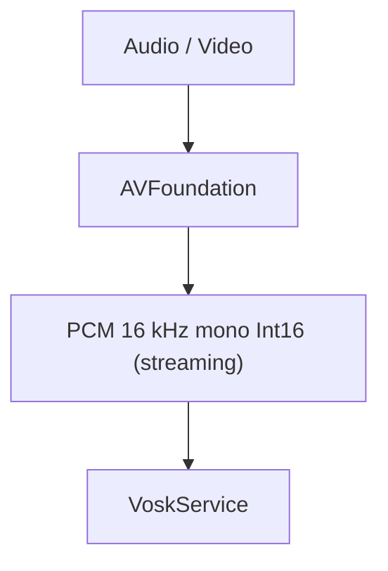

# Technical Design

## Context

La versión actual de Transcriptor utiliza `SpeechAnalyzer`, `SpeechTranscriber` y `Speech.AssetInventory`, disponibles únicamente a partir de macOS 26.0 con Apple Silicon.

Esta variante `legacy-intel` está destinada a:

* Macs Intel con macOS 11 Big Sur como sistema mínimo (p. ej. MacBook Air 2015 con 8 GB RAM e i5 a 1,6 GHz ya instalado con Big Sur). Al fijar el deployment target en 11.0, la aplicación corre también en macOS 12, 13, 14, 15, 26…
* Equipos sin Neural Engine de Apple.

En macOS 11/12 para Intel, la única API de transcripción de Apple disponible es `SFSpeechRecognizer`, que en dispositivos sin Neural Engine requiere conexión con los servidores de Apple. Esto viola los requisitos de privacidad y offline de la aplicación.

Se requiere un motor de transcripción alternativo embebido, local, eficiente en CPU Intel de gama baja, y con capacidades de streaming para mantener la arquitectura de memoria existente.

---

## Goals / Non-Goals

### Goals

* Variante de Transcriptor para Intel x86_64.
* macOS 11.0 (Big Sur) como deployment target mínimo; el binario corre en macOS 11 y superiores.
* Motor de transcripción local Vosk (Kaldi) embebido como librería C estática.
* Offline completo tras la instalación del modelo de idioma.
* Mismo comportamiento de usuario que la versión actual en: drag & drop, idioma, timestamps, cola, progreso, cancelación, Markdown incremental.
* Procesamiento por streaming: sin cargar archivos completos en memoria.
* Compatible con 8 GB RAM.
* Reutilizar la mayor parte del código existente de UI, media y exportación.

### Non-Goals

* Apple Silicon en esta variante.
* Soporte para macOS anterior a 11.0 (Big Sur).
* Integración con las APIs de Speech de Apple.
* Backend ni servicios externos.
* Detección automática de idioma ni traducción.

---

## Decisions

### 1. Swift + SwiftUI

Mantener Swift como lenguaje principal y SwiftUI para la interfaz, igual que la versión actual.

No introducir frameworks externos salvo la librería C de Vosk, que es el motor de transcripción.

Utilizar Swift Concurrency y evitar bloqueos del hilo principal.

---

### 2. Arquitectura

Mantener la arquitectura MVVM ligera de la versión actual:

* Views
* ViewModels
* Services
* Exporters

El cambio fundamental es sustituir el `SpeechAnalyzerService` y `SpeechAssetManager` por componentes Vosk, manteniendo el resto de la arquitectura prácticamente inalterada.

---

### 3. Motor de transcripción: Vosk (Kaldi)

El motor de transcripción será Vosk, integrado como librería C estática con una API C mínima.

Por qué Vosk (y no whisper.cpp):

* **Diseñado para hardware débil**: funciona en Raspberry Pi y CPUs Intel modestas en tiempo real.
* **Streaming nativo**: la API `AcceptWaveform` acepta buffers de PCM pequeños y devuelve resultados por utterance, sin necesitar ventanas de 30 s como whisper.
* **Modelo pequeño de español**: `vosk-model-small-es-0.42` — 39 MB, bajo consumo de memoria.
* **Licencia Apache 2.0**: permisiva para distribución comercial.

El código propio se integrará mediante un puente C:


O alternativa viable (a evaluar durante la implementación): embeber un binario CLI de Vosk y comunicarse vía `Process`/stdin/stdout, eliminando la complejidad del puente C directo.

La biblioteca Vosk se compilará como un `libvosk.a` estático x86_64 para macOS 11, optimizado con `-O2` y enlazado con Accelerate (si aplica) o Accelerate framework.

---

### 4. Servicio de transcripción

`TranscriptionService` (fachada única que implementa el protocolo `Transcribing` que consume la cola) delega en un `VoskService` de bajo nivel:


`VoskService`:

1. Recibe la URL del archivo multimedia.
2. Negotiar el formato de audio (16 kHz, mono, 16 bits, PCM) con `AudioStreamProvider`.
3. Alimentar al modelo Vosk con buffers de PCM.
4. Extraer resultados con información temporal (timestamps de palabra) de cada utterance.
5. Convertir a `TranscriptionSegment` y llamar a `onSegment`.
6. Reportar el final del flujo para que `TranscriptionService` calcule el progreso por duración procesada / duración total.

---

### 5. Gestión de modelos Vosk

Los modelos Vosk son directorios locales conteniendo `am/final.mdl`, `conf/`, `graph/` etc. A diferencia de Apple, no son activos del sistema; la aplicación debe gestionarlos por sí misma.

#### Resolución de modelo

Se utilizará una convención de nombres interna:

* `vosk-model-small-es` → modelo pequeño español
* `vosk-model-es` → modelo grande español
* `vosk-model-small-en` → modelo pequeño inglés
* etc.

El modelo se resolverá a partir del locale seleccionado por el usuario.

#### Comprobación de instalación

Antes de iniciar una transcripción, la aplicación comprobará si el directorio del modelo existe en la ruta local de modelos (`~/Library/Application Support/Transcriptor/models/` o equivalente).

#### Instalación

Si el modelo no está instalado pero existe conexión a Internet, se podrá descargar automáticamente desde `alphacephei.com/vosk/models`. Se mostrará el progreso de descarga.

Si no existe conectividad y el modelo no está instalado, se mostrará un error informando al usuario.

#### Offline

Una vez instalado el modelo, la transcripción SHALL funcionar completamente offline.

---

### 6. Formato de audio

Vosk requiere PCM mono de 16 kHz, 16 bits, entero.

El pipeline modificará la negociación de formato paraforzar este objetivo, independientemente del formato original del archivo.



Si el audio original es estéreo o tiene una frecuencia de muestreo diferente, `AudioStreamProvider` realizará la conversión mediante streaming sin crear una copia completa en memoria.

---

### 7. Timestamps

Vosk proporciona timestamps a nivel de palabra en cada utterance completada:

```json
{
  "result": [
    {"start": 0.00, "end": 0.40, "word": "hola"},
    {"start": 0.45, "end": 1.20, "word": "mundo"}
  ]
}
```

El servicio agregará estos resultados en `TranscriptionSegment` (con `start` y `end` calculados a partir de las palabras del utterance) y los pasará al `ParagraphAggregator`, que agrupa por pausas naturales exactamente igual que la versión actual.

Los timestamps de párrafo se calculan a partir del `start` del primer segmento del párrafo, manteniendo la misma semántica que la versión Apple Silicon.

---

### 8. Memoria

El mismo modelo streaming se aplicará:

* Streaming de audio (AVFoundation → buffers PCM).
* Streaming de resultados (Vosk → segmentos → párrafos → disco).
* Sin acumular la transcripción completa en memoria.
* Modelo Vosk: ~39 MB para el pequeño español, cargado una vez al inicio de la primera transcripción, permanece residente durante la sesión.

Objetivo: consumo de memoria razonablemente estable, aproximadamente independiente de la duración del archivo (salvo buffers del modelo y buffers de audio).

---

### 9. Cancelación

Mismo modelo que la versión actual:

* La cancelación SHALL atravesar UI → `TranscriptionJob` → `TranscriptionQueue` → `AudioStreamProvider` → `VoskService`.
* El lector SHALL detenerse.
* El modelo Vosk SHALL liberarse.
* No se deberán dejar archivos parciales en disco.

---

### 10. UI

La interfaz SHALL ser prácticamente idéntica a la versión actual, salvo:

* La selección de idioma mostrará los idiomas disponibles en la instalación Vosk local, no los de Apple Speech.
* El mensaje de privacidad indicará que la transcripción se realiza localmente en el dispositivo usando un motor de código abierto, no las APIs de Apple.

---

### 11. Errores

Mismo enfoque que la versión actual: separar errores internos de mensajes de usuario.

Los errores específicos de Vosk a cubrir:

* Modelo no encontrado.
* Modelo corrupto / incompatible.
* Audio sin formato convertible a PCM 16 kHz.
* Fallo de memoria / modelo excesivo para el equipo.
* Descarga de modelo fallida.

---

## Constraints

```text
macOS 11.0+
Intel x86_64
8 GB RAM target
16 kHz mono Int16 PCM input
Vosk C library (static)
No cloud
No Neural Engine dependency
Streaming processing
```

---

## Open Questions

1. Puente C directo (`libvosk.a` + header) vs CLI embebido con `Process`. → **Resuelto en Spike: puente C directo** (API mínima y estable, sin proceso externo).
2. Estrategia de distribución de los modelos Vosk (incluir en el DMG o descargar a demanda).
3. Límite de duración de archivo para evitar tiempos de procesamiento excesivos en hardware antiguo.
4. Validación del rendimiento real en un MacBook Air 2015 con diferentes modelos (tiny / small / medium de Vosk). (Spike: factor en vivo 0.01–0.02 en Apple Silicon; pendiente en Intel)
5. Soporte multilingüe completo o solo español + inglés en la primera release.
6. **macOS 11 + stdlib Swift**: el toolchain Swift 6.3 enlaza `libswiftCore`/`libswift_Concurrency` del SDK anfitrión (26.0). Para un binario que corra en macOS 11 hay que evaluar `-static-stdlib` o verificar stdlib compatible; si no, subir el min (opción contraria a este design). Validar en Fase 1 (task 1.6).
7. **Distribución de `libvosk.dylib`**: el dylib oficial tiene install name plano (`libvosk.dylib`). En producción habrá que o bien embeber en el `.app` con `@rpath`, o usar un `libvosk.a` estático (prebuilt estabilizado o build propio x86_64). Decidir en Fase 11/Spike.

---

## Decisions (macOS 11 compatibility)

El deployment target macOS 11 impone sustituir APIs que solo existen en versiones posteriores. Mantener la semántica de usuario igual:

* **Observación**: `@Observable`/`@Bindable` (Observation, macOS 14) se sustituyen por `ObservableObject` + `@Published` + Combine en `TranscriptionViewModel`, `LogStore` y las vistas que los consumen.
* **Tiempo**: `Duration` (macOS 13) se sustituye por `Double` (segundos) en `MediaInfo`, `TranscriptionSegment`, `TranscriptionParagraph`, `TranscriptionSummary`, `ParagraphAggregator`, `MarkdownWriter` y `TranscriptionService`. `ContinuousClock` (macOS 13) se sustituye por throttle basado en `Date` en `TranscriptionQueue`.
* **Streaming**: `AudioBuffersStream` es un `AsyncSequence` propio (compatible macOS 10.15), no requiere `AsyncStream`. `AnalyzerInput` deja de importarse desde Speech y se define como tipo propio.
* **SwiftUI**: `.foregroundStyle`, `.textSelection`, `.monospacedDigit`, `.formatted(date:time:)`, `.listRowSeparator` y las escenas `Window(id:)`/`openWindow` (todas macOS 12+/13+) se reemplazan por equivalentes disponibles en macOS 11 (`.foregroundColor`, fuentes explícitas, `DateFormatter`, escena `WindowGroup` con selección manual, etc.).
* **AVFoundation**: el `await asset.load(...)` (macOS 12) se sustituye por carga síncrona de propiedades una vez abierto el asset.