# Technical Design

## Context

La aplicación será una aplicación nativa de macOS exclusivamente para Apple Silicon (`arm64`).

El núcleo de transcripción se basará en `SpeechAnalyzer` y `SpeechTranscriber`. Apple proporciona los modelos de Speech como recursos gestionados por el sistema; la aplicación no debe empaquetar ni administrar directamente dichos modelos.

La aplicación tendrá como requisito mínimo **macOS 26.0**, ya que `SpeechAnalyzer`, `SpeechTranscriber` y `Speech.AssetInventory` están disponibles a partir de esa versión.

La entrada podrá proceder directamente de un archivo de audio o de la pista de audio de un vídeo. El pipeline deberá procesar el contenido de forma incremental para mantener bajo y predecible el consumo de memoria.

El Spike técnico realizado en `Spike/` ha validado el núcleo del pipeline de audio:

* `SpeechTranscriber` puede consumir un `AsyncSequence` de `AnalyzerInput`.
* `AVAssetReaderAudioMixOutput` puede alimentar dicho pipeline de forma incremental.
* La transcripción completa funciona sin generar un archivo de audio temporal completo.
* Los resultados pueden incluir información temporal mediante `audioTimeRange`.
* La cancelación puede propagarse correctamente.
* La instalación de assets mediante `AssetInventory` funciona.
* El consumo de memoria observado no crece linealmente con la duración del archivo en las pruebas realizadas.

El Spike se considera evidencia técnica y código experimental. No forma parte del código de producción y no debe copiarse directamente sin adaptar sus decisiones a la arquitectura definitiva.

---

## Goals / Non-Goals

### Goals

* Aplicación nativa Apple Silicon.
* macOS 26.0 o posterior.
* Arquitectura sencilla y mantenible.
* Transcripción completamente local.
* Bajo consumo de memoria.
* Streaming de audio.
* Procesamiento de archivos largos.
* Soporte de archivos de audio y vídeo.
* Resultados procesados incrementalmente.
* Escritura Markdown incremental.
* Timestamps opcionales por párrafo.
* Cola secuencial de trabajos.
* Cancelación fiable.
* UI sencilla para usuarios no técnicos.
* Gestión transparente de assets de Speech.
* Base preparada para distribución mediante DMG.

### Non-Goals

* Intel.
* Backend.
* Cloud transcription.
* Traducción.
* Detección automática de idioma.
* Speaker diarization.
* SRT.
* VTT.
* Subtítulos.
* Reproductor integrado.
* Procesamiento paralelo de trabajos.
* Modelos propietarios o personalizados.
* Sincronización en la nube.

---

## Decisions

### 1. Swift + SwiftUI

Utilizar Swift como lenguaje principal y SwiftUI como framework de interfaz.

No introducir frameworks externos de UI salvo que exista una necesidad técnica demostrable.

Utilizar Swift Concurrency para las operaciones asíncronas y evitar bloqueos del hilo principal.

---

### 2. Arquitectura MVVM ligera

Utilizar una arquitectura sencilla basada en:

* Views
* ViewModels
* Models
* Services

Evitar arquitecturas excesivamente complejas como TCA.

Una estructura inicial será:

```mermaid
flowchart TD
    Transcriptor["Transcriptor/"]
    Transcriptor --> App["App/"]
    App --> TApp["TranscriptorApp.swift"]
    App --> Env["AppEnvironment.swift"]
    Transcriptor --> Features
    Features --> Transcription["Features/Transcription/"]
    Transcription --> TView["TranscriptionView.swift"]
    Transcription --> TViewModel["TranscriptionViewModel.swift"]
    Transcription --> TState["TranscriptionState.swift"]
    Transcriptor --> Models
    Models --> MediaFile["MediaFile.swift"]
    Models --> Segment["TranscriptionSegment.swift"]
    Models --> Job["TranscriptionJob.swift"]
    Models --> Settings["TranscriptionSettings.swift"]
    Transcriptor --> Services
    Services --> Speech["Services/Speech/"]
    Speech --> SService["SpeechAnalyzerService.swift"]
    Speech --> SManager["SpeechAssetManager.swift"]
    Services --> Media["Services/Media/"]
    Media --> MAnalyzer["MediaAnalyzer.swift"]
    Media --> Stream["AudioStreamProvider.swift"]
    Media --> Converter["AudioFormatConverter.swift"]
    Services --> Queue["Services/Queue/"]
    Queue --> TQueue["TranscriptionQueue.swift"]
    Services --> Files["Services/Files/"]
    Files --> Validator["FileValidator.swift"]
    Files --> Destination["FileDestinationService.swift"]
    Transcriptor --> Exporters
    Exporters --> Writer["Exporters/MarkdownWriter.swift"]
    Transcriptor --> Logging
    Logging --> Log["Logging/AppLogger.swift"]
```

La estructura es orientativa. Las responsabilidades podrán reorganizarse si la implementación real de las APIs de Apple lo requiere, pero debe evitarse introducir capas o abstracciones que no aporten una necesidad concreta.

---

### 3. SpeechTranscriber como motor

Utilizar `SpeechTranscriber` para la transcripción y `SpeechAnalyzer` como coordinador del análisis.

La aplicación utilizará un preset orientado a resultados indexados temporalmente:

```swift
timeIndexedTranscriptionWithAlternatives
```

La aplicación no necesita resultados progresivos o provisionales para el caso de uso actual.

Los resultados finales deberán conservar información temporal suficiente para construir `TranscriptionSegment`.

El flujo validado por el Spike es:

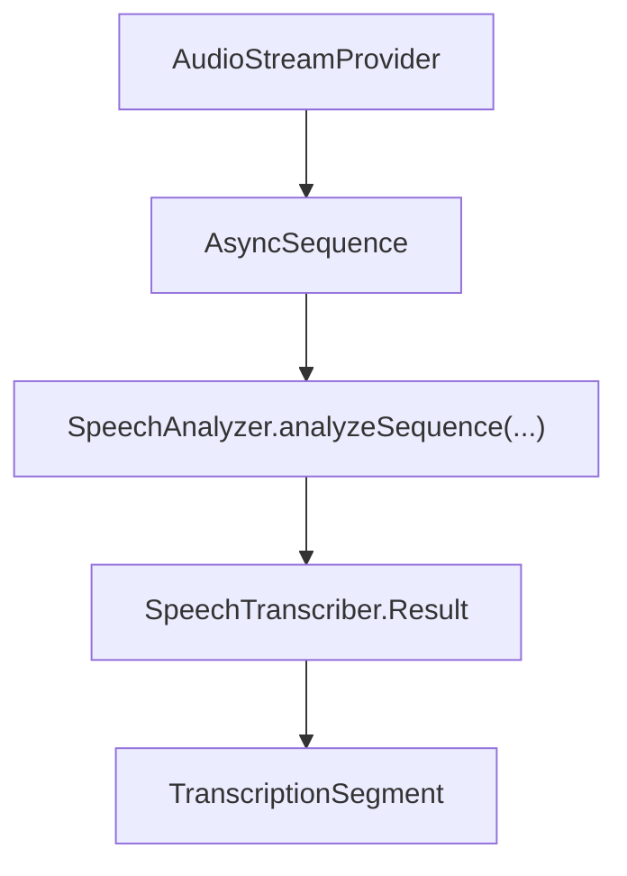

Al finalizar la entrada se utilizará el último tiempo de muestra proporcionado por `analyzeSequence`:

```swift
let lastSampleTime = try await analyzer.analyzeSequence(inputSequence)

if let lastSampleTime {
    try await analyzer.finalizeAndFinish(through: lastSampleTime)
}
```

La implementación de producción deberá mantener esta secuencia de finalización, ya que el Spike comprobó que una combinación alternativa basada únicamente en `start(inputSequence:)` y `finalizeAndFinishThroughEndOfInput()` no produjo resultados completos en las pruebas realizadas.

---

### 4. SpeechAssetManager

Crear un servicio específico responsable de la gestión de assets de Speech.

Sus responsabilidades serán:

1. Resolver el locale solicitado.
2. Comprobar si el locale está soportado.
3. Comprobar si el locale está instalado.
4. Solicitar la instalación cuando sea necesario.
5. Exponer el progreso de instalación.
6. Liberar reservas de locales.
7. Informar de errores de instalación.
8. Diferenciar correctamente los casos offline.

La aplicación no implementará lógica propia para descargar, almacenar o cargar modelos.

#### Resolución de locale

Utilizar `SpeechTranscriber.supportedLocale(equivalentTo:)` cuando sea necesario resolver una petición genérica como `es` a un locale soportado concreto.

#### Comprobación de instalación

La fuente principal para determinar si el idioma está instalado será:

```swift
SpeechTranscriber.installedLocales
```

El Spike demostró que `AssetInventory.status(forModules:)` no debe utilizarse como único criterio para determinar si un idioma está instalado.

En particular:

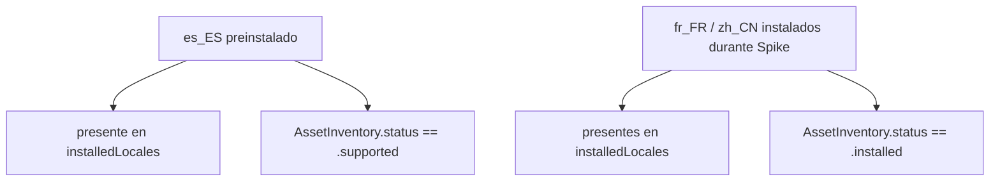

Por tanto:

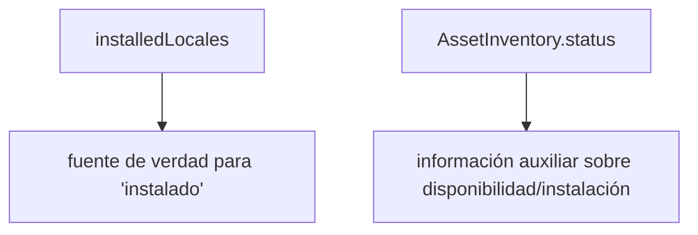

No se deberá rechazar un idioma simplemente porque `AssetInventory.status` devuelva `.supported` si el locale aparece en `installedLocales`.

#### Instalación

Cuando el locale no esté instalado pero sea soportado, utilizar:

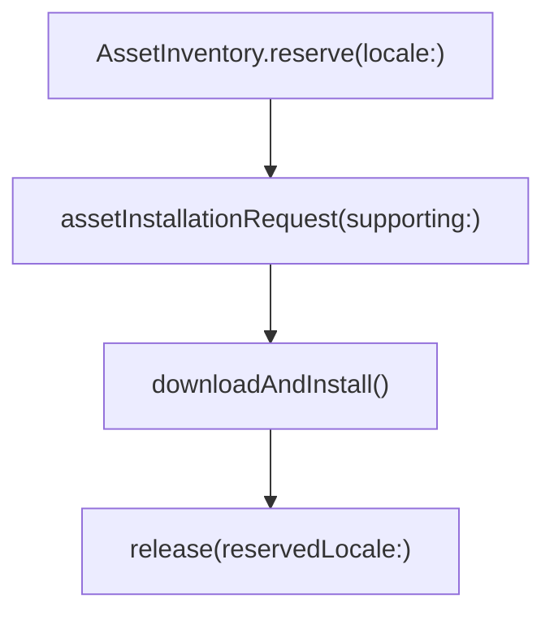

El progreso se expondrá mediante `AssetInstallationRequest.progress`.

---

### 5. Preparación del audio

El pipeline deberá determinar el formato de audio más apropiado para Speech antes de comenzar a leer el archivo.

Utilizar:

```text
SpeechAnalyzer.bestAvailableAudioFormat(...)
```

para obtener un formato compatible y evitar conversiones innecesarias.

Cuando sea necesario preparar el analizador previamente podrá utilizarse:

```text
SpeechAnalyzer.prepareToAnalyze(in:)
```

La aplicación no deberá generar un archivo WAV temporal completo como paso normal del procesamiento.

El flujo preferido será:

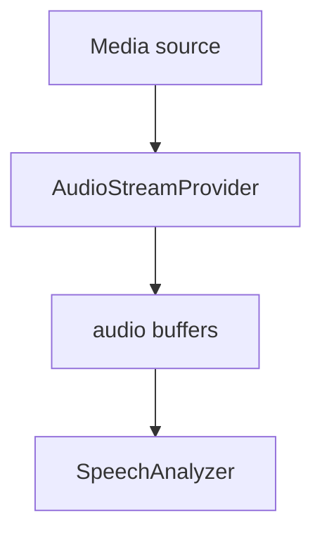

---

### 6. Audio procedente de archivos y vídeo

El acceso multimedia estará encapsulado detrás de servicios de Media.

Para vídeo se utilizará AVFoundation.

Flujo conceptual:

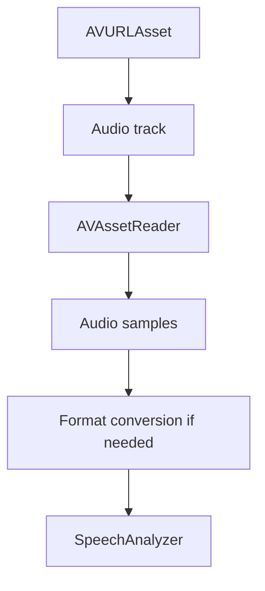

Para audio se utilizará el mismo concepto de streaming, evitando crear una copia completa del archivo en memoria.

`AVAssetReaderAudioMixOutput` será la implementación inicial para obtener audio desde `AVAssetReader`.

El soporte end-to-end de MP4/MOV/M4V y la validación de distintos formatos de audio deberán completarse durante la implementación y las pruebas de Media.

---

### 7. Conversión de sample buffers

Cuando sea posible, la conversión de `CMSampleBuffer` a `AVAudioPCMBuffer` deberá evitar copias innecesarias.

El Spike validó la siguiente estrategia:

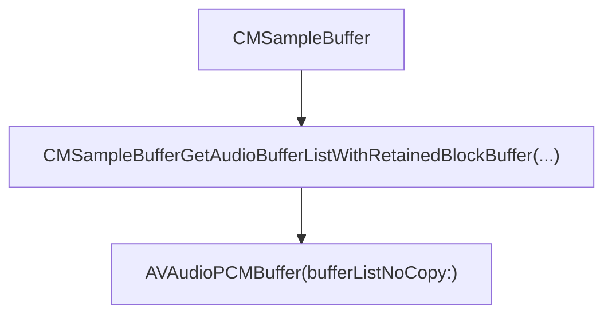

El `CMBlockBuffer` asociado deberá mantenerse retenido mientras el `AVAudioPCMBuffer` permanezca válido.

Esta optimización deberá permanecer encapsulada dentro del servicio de Media y no propagarse al resto de la aplicación.

Si una determinada ruta multimedia no permite realizar esta conversión de forma segura, se priorizará la corrección sobre la eliminación de una copia.

---

### 8. Backpressure y ritmo de lectura

El pipeline de entrada debe impedir tanto la pérdida de audio como el crecimiento ilimitado de memoria.

El Spike demostró:

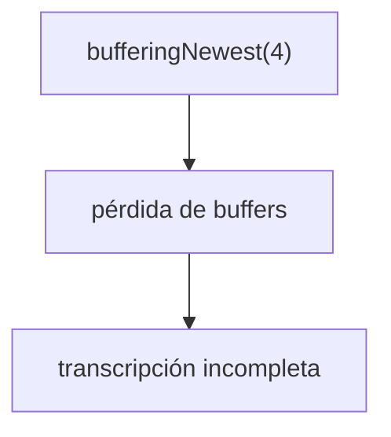

Por tanto, **no se utilizará `bufferingNewest` para alimentar SpeechAnalyzer**.

También se evitará utilizar indefinidamente:

```text
bufferingUnbounded
```

como solución final, ya que permitiría acumular una cantidad potencialmente ilimitada de audio si el lector produce más rápido que SpeechAnalyzer.

La arquitectura de producción deberá implementar **backpressure explícito o pacing del productor**.

Conceptualmente:

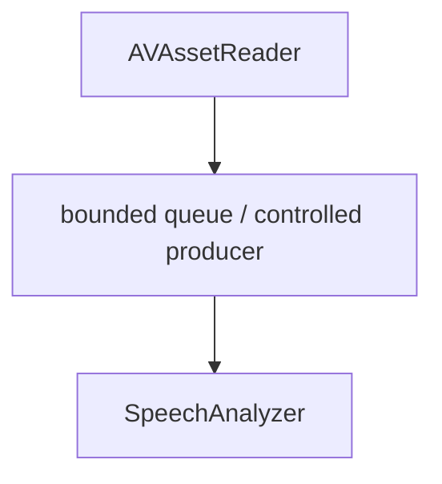

El productor deberá esperar o reducir su ritmo cuando el consumidor no pueda aceptar más datos.

El mecanismo concreto podrá ser un `AsyncStream` con coordinación adicional, un canal/buffer asíncrono acotado o una abstracción equivalente de Swift Concurrency.

Requisito fundamental:


No se debe resolver el problema de presión de memoria descartando buffers.

---

### 9. Modelo de memoria

El pipeline deberá seguir estrictamente un modelo streaming:

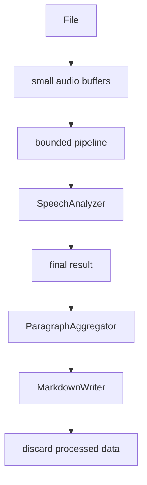

No se deberá:

* cargar el vídeo completo en memoria;
* cargar el audio completo en memoria;
* mantener todos los resultados de Speech en memoria;
* generar innecesariamente archivos temporales gigantes;
* ejecutar varias transcripciones simultáneamente.

El objetivo es que el uso de memoria sea aproximadamente independiente de la duración del archivo, salvo buffers y estructuras internas inevitables de los frameworks de Apple.

#### Evidencia del Spike

Las pruebas realizadas produjeron:

| Archivo            | Duración | Pico observado |
| ------------------ | -------: | -------------: |
| `meeting.m4a`      |    ~59 s |        10.5 MB |
| `meeting_long.m4a` |    ~5:57 |        18.0 MB |

Estas cifras son evidencia inicial, no un presupuesto definitivo de memoria.

Todavía deberá realizarse validación con archivos considerablemente más largos y con diferentes formatos.

---

### 10. Modelo interno de resultados

Los resultados internos deberán conservar al menos:

```swift
struct TranscriptionSegment {
    let start: Duration
    let end: Duration
    let text: String
}
```

Esta estructura representa una unidad lógica de resultado y no implica que deba existir:

```swift
[TranscriptionSegment]
```

para todo el archivo.

Los segmentos deberán procesarse incrementalmente:

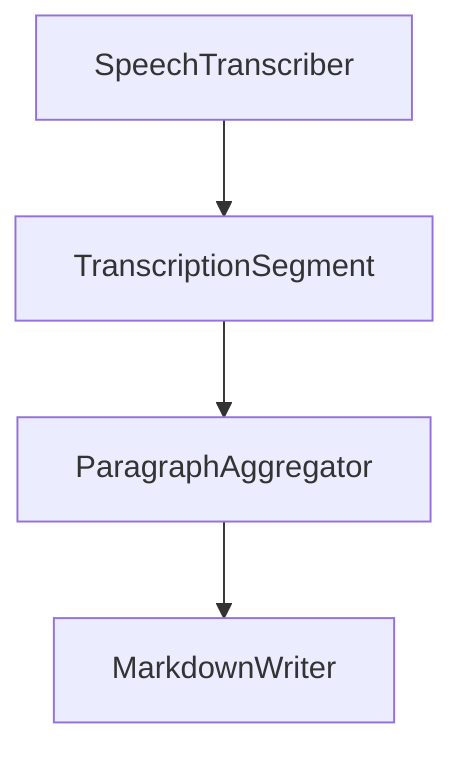

Una vez escrito un bloque y liberadas sus referencias, los datos asociados deberán poder salir de memoria.

---

### 11. Agrupación en párrafos

Los resultados de Speech no deben tratarse automáticamente como párrafos editoriales.

Se implementará un `ParagraphAggregator` que reciba segmentos/resultados incrementalmente y produzca bloques de texto exportables.

El timestamp del bloque será el `start` del primer segmento incluido:

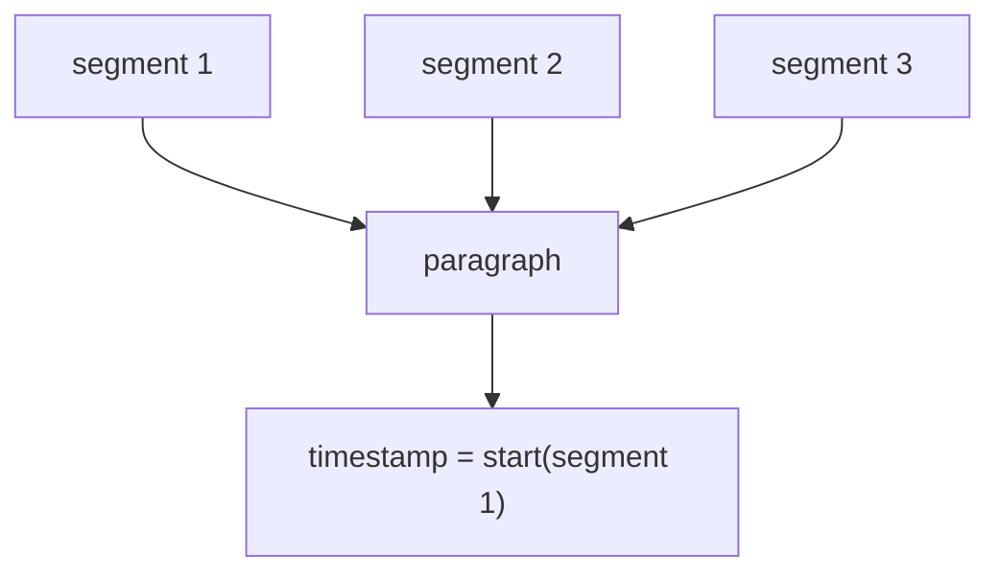

No utilizar una regla fija del tipo:

```text
un timestamp cada X segundos
```

porque podría separar frases o ideas arbitrariamente.

La estrategia inicial deberá considerar límites naturales del texto y pausas temporales, pero debe mantenerse desacoplada del motor de Speech para poder evolucionar posteriormente.

El objetivo del timestamp es permitir al usuario localizar rápidamente el punto correspondiente en el audio/vídeo original, no generar subtítulos.

---

### 12. MarkdownWriter

`MarkdownWriter` recibirá bloques de texto progresivamente y escribirá directamente al destino.

Conceptualmente:

```swift
MarkdownWriter(
    destination: outputURL,
    includeTimestamps: settings.includeTimestamps
)
```

Con timestamps:

```markdown
### [00:03:47]

Como sabéis, llevamos dos semanas trabajando
en la nueva arquitectura.
```

Sin timestamps:

```markdown
Como sabéis, llevamos dos semanas trabajando
en la nueva arquitectura.
```

El writer será responsable únicamente de:

* crear el archivo;
* escribir bloques;
* representar timestamps;
* mantener el formato Markdown;
* cerrar correctamente el archivo.

No será responsable de transcribir ni de decidir cómo se agrupan los párrafos.

La escritura deberá ser incremental para evitar acumular el documento completo en memoria.

---

### 13. Cola de trabajos

La primera versión utilizará una cola estrictamente secuencial:


Solo habrá un job de transcripción activo simultáneamente.

Esto limita:

* presión sobre CPU;
* consumo de memoria;
* temperatura;
* competencia por recursos de Speech;
* complejidad de cancelación.

Los trabajos pendientes podrán permanecer representados mediante metadatos ligeros, sin cargar su contenido multimedia.

---

### 14. Cancelación

La cancelación deberá atravesar todas las capas relevantes:

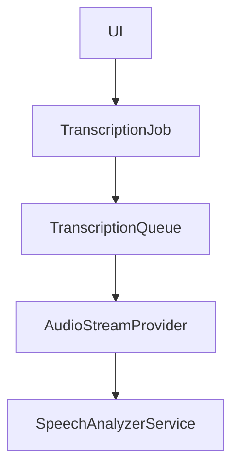

El lector deberá detenerse cuando el job sea cancelado.

El analizador deberá finalizar/cancelar su procesamiento de forma ordenada.

El Spike validó que:

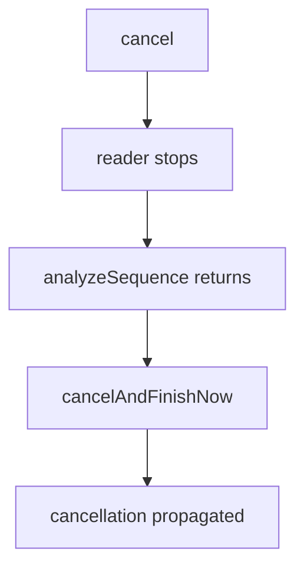

La implementación de producción deberá garantizar la liberación de recursos mediante cancelación estructurada y `defer` cuando sea apropiado.

---

### 15. UI

La pantalla principal deberá seguir un flujo sencillo:

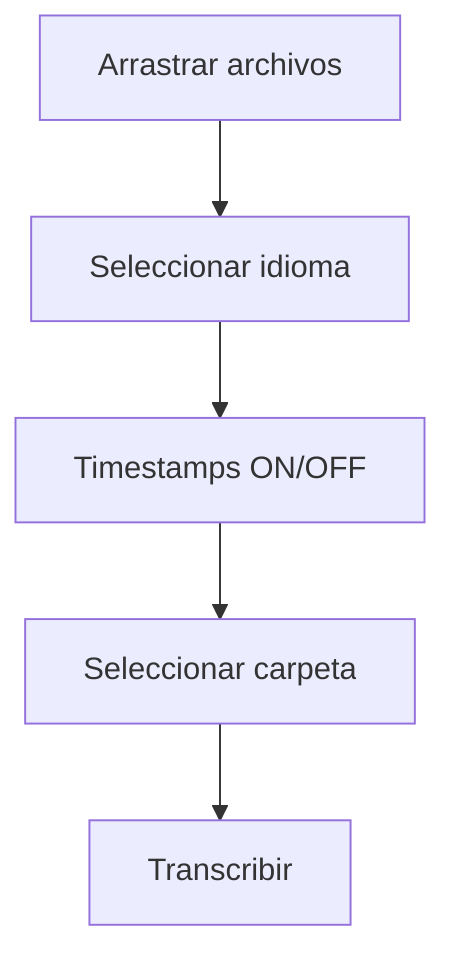

Debe permitir:

* drag & drop;
* selección mediante diálogo;
* selección explícita de idioma;
* español como opción predeterminada;
* activación/desactivación de timestamps;
* selección de carpeta de destino;
* visualización de cola;
* progreso del trabajo actual;
* cancelación;
* errores comprensibles;
* acceso a información técnica/logs cuando sea necesario.

No mostrar detalles técnicos innecesarios durante el uso normal.

---

### 16. Errores

Separar errores internos de mensajes de usuario.

Ejemplo:

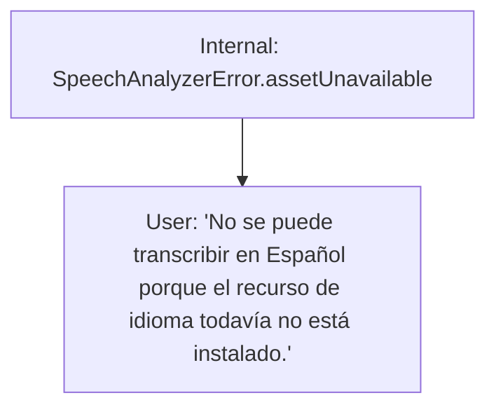

Los detalles técnicos deberán registrarse mediante `AppLogger`.

Los errores deberán distinguir, como mínimo:

* archivo no compatible;
* archivo sin pista de audio;
* idioma no soportado;
* idioma no instalado;
* instalación de asset fallida;
* falta de conectividad durante instalación;
* error de lectura multimedia;
* error de Speech;
* cancelación;
* error de escritura;
* destino no disponible.

---

### 17. Privacidad

La aplicación no implementará ninguna comunicación de red propia.

La única actividad de red prevista será la descarga de assets de Speech gestionada por Apple cuando el usuario solicite un idioma que todavía no esté instalado.

No enviar:

* archivos;
* audio;
* vídeo;
* transcripciones;
* metadatos del usuario

a ningún servidor propio o de terceros.

Una vez instalado el asset necesario, la transcripción deberá poder realizarse sin conexión de red.

La prueba física con la red completamente deshabilitada queda como validación pendiente.

---

### 18. Concurrencia

Utilizar Swift Concurrency.

El pipeline deberá evitar bloqueos del hilo principal.

La UI deberá permanecer responsiva durante:

* análisis multimedia;
* instalación de assets;
* transcripción;
* escritura;
* cancelación.

Las referencias a buffers multimedia deberán tener una vida útil claramente delimitada para evitar retenciones accidentales.

---

### 19. Distribución

El proyecto deberá estar configurado para:

```text
Architecture: arm64
Deployment target: macOS 26.0
```

La generación de DMG, firma y notarización se tratará como una fase posterior, una vez estabilizado el producto.

---

## Risks / Trade-offs

### [Requirement] Deployment target mínimo macOS 26.0

Las APIs de transcripción utilizadas por la aplicación requieren macOS 26.0 o posterior.

→ Declarar `macOS 26.0` como deployment target.

La aplicación no será compatible con versiones anteriores de macOS.

---

### [Risk] Cambios en APIs de Speech

Apple puede modificar APIs, disponibilidad de idiomas o comportamiento de los assets.

→ Aislar todo acceso a Speech dentro de `SpeechAnalyzerService` y `SpeechAssetManager`.

---

### [Risk] Disponibilidad de idiomas

Los idiomas soportados e instalados dependen del sistema y de los assets disponibles.

→ Resolver locales mediante las APIs de Speech y no mantener una lista propia estática de idiomas instalables.

---

### [Risk] Formatos multimedia poco habituales

No todos los archivos multimedia se comportan igual mediante AVFoundation.

→ Validar mediante `MediaAnalyzer` antes de comenzar la transcripción.

→ Mantener el soporte de formatos explícitamente probado.

---

### [Risk] Vídeos sin pista de audio

Un vídeo puede ser válido pero no contener audio.

→ Detectarlo antes de iniciar el análisis y mostrar un error específico.

---

### [Risk] Modelo no instalado

El usuario puede intentar trabajar offline con un idioma cuyo asset no está instalado.

→ Detectarlo antes de comenzar y mostrar una explicación sencilla.

---

### [Risk] Backpressure

Si el productor de audio genera datos más rápido que SpeechAnalyzer, un buffer ilimitado podría consumir memoria de forma creciente.

→ Implementar backpressure/pacing explícito.

→ No utilizar políticas que descarten buffers.

---

### [Risk] Consumo de memoria

Un pipeline que acumule resultados puede crecer con la duración del archivo.

→ Streaming.

→ Buffer acotado.

→ Escritura incremental.

→ No mantener el transcript completo.

→ Validar con archivos largos.

---

### [Risk] Agrupación incorrecta de párrafos

Speech no necesariamente devuelve párrafos editoriales.

→ Mantener `ParagraphAggregator` independiente del motor de Speech.

→ Permitir evolucionar la heurística sin modificar el pipeline de audio.

---

### [Risk] Cancelación

Cancelar tareas asíncronas de Speech y AVFoundation puede requerir una liberación ordenada de recursos.

→ Centralizar la cancelación en el job actual.

→ Utilizar cancelación estructurada.

→ Garantizar cleanup mediante `defer` cuando sea necesario.

---

### [Risk] Optimización no-copy

Las conversiones no-copy de buffers reducen copias potenciales, pero introducen requisitos estrictos de lifetime.

→ Encapsularlas en `AudioFormatConverter`/`AudioStreamProvider`.

→ Priorizar seguridad y corrección sobre la eliminación de una copia cuando exista alguna duda sobre la vida útil del buffer.

---

## Migration Plan

No existe migración porque se trata de una aplicación nueva.

El Spike técnico ya se ha completado y debe conservarse como referencia técnica independiente en:

```text
Spike/
```

El desarrollo de producción deberá partir de los resultados validados por dicho Spike.

Orden recomendado de implementación:

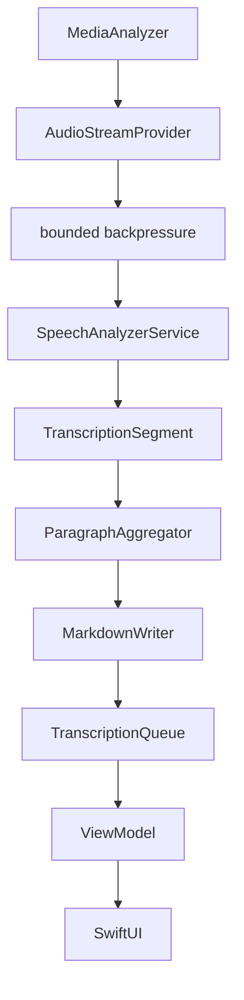

La UI completa no debe ser el primer objetivo de implementación.

---

## Open Questions

No existen preguntas bloqueantes para comenzar la implementación del pipeline.

Quedan decisiones técnicas no bloqueantes que deberán resolverse durante la implementación:

1. Mecanismo concreto de backpressure/bounded buffer.
2. Heurística exacta de `ParagraphAggregator`.
3. Estrategia final de reporting de progreso.
4. Tratamiento específico de determinados formatos multimedia.
5. Diseño final de la pantalla de logs.
6. Validación de comportamiento offline con red físicamente deshabilitada.
7. Validación de memoria con archivos significativamente más largos.
8. Validación end-to-end de MP4, MOV y M4V.
9. Validación de MP3 y WAV.

Estas decisiones no deben modificar los requisitos fundamentales establecidos en este diseño:

```text
No cloud
No data loss
Bounded memory
Streaming
Sequential processing
Explicit language
Markdown output
macOS 26+
Apple Silicon
```
